Diagrama de flujo función EXTRACCIONES. 

```mermaid
graph
    A([Inicio]) --> B(saldo=funciones.seleccionar_moneda) 
    B --> C(intento=0)
    C --> D[while intento < 2]
    D --> E[/"monto=int(input('Ingrese el monto a retirar'))"/]
    E --> F(intento+=1)
    F --> G{monto <= saldo}
    G --> |si| H[cliente.saldo-=monto]
    H --> I(intento+=1)
    I --> J("print('Retire su dinero')")
    G --> |no| K{monto>saldo}
    K --> |si| L("print('No posse saldo suficiente')")
    L --> M{intento < 2}
    M --> |si| N("print('1.Modificar monto.  2.Volver al menu')")
    N --> O[/"eleccion=input()"/]
    O --> P{eleccion=='2'}
    P --> |si| Q[intento+=1]
    Q --> R((Fin))
    M --> R
    J --> R
    P --> |no| D
  ```

Grafo de complejidad función EXTRACCIONES.

```mermaid
graph 
    Nombre[Grafo de complejidad ciclomatica EXTRACCIONES]
    A((1)) --> |I| B((2))
    B --> |II|C((3))
    C --> |III|D((4))
    D --> |IV| E((5))
    E --> |V|F((6))
    F --> |VI|G((7))
    G --> |si - VII| H((8))
    H -->|VIII| I((9))
    I -->|IX| J((10))
    G --> |no - XI| K((12))
    K --> |si - XII| L((13))
    L --> |XIII|M((14))
    M --> |si - XIV| N((15))
    N --> |XV|O((16))
    O --> |XVI|P((16))
    P --> |si- XVII| Q((17))
    Q --> |XVIII|R((11))
    M --> |XIX|R
    J -->|X| R
    P --> |no- XX| D
```  

Calculos complejidad cilomatica función EXTRACCIONES:

-V(G)=Regiones=4.\
-V(G)=A-N+2=20-18+2=4.\
-V(G)=P+1=3+1=4.

Caminos posibles función EXTRACCIONES:

-1-2-3-4-5-6-7-8-9-10-11\
-1-2-3-4-5-6-7-12-13-14-15-16-17-18-11\
-1-2-3-4-5-6-7-12-13-14-11\
-1-2-3-4-5-6-7-12-13-14-15-16-17-4-5-6-7-12-13-14-11

-----------------------------------------------------------------------------------------------------------------------------------------------------------------------

Diagrama de flujo de la función CLIENTES:

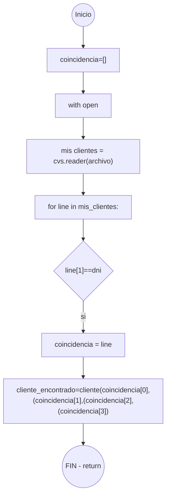

Grafo de complejidad ciclomatica función CLIENTES:

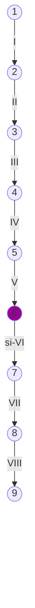
Calculos complejidad cilomatica función CLIENTES:

-V(G)=Regiones=1.\
-V(G)=A-N+2=9-9+2=1.\
-V(G)=P+1=0+1=1.

Caminos posibles función CLIENTES:

-1-2-3-4-5-6-7-8-9


-----------------------------------------------------------------------------------------------------------------------------------------------------------------------

Diagrama de flujo función CONSULTAS:

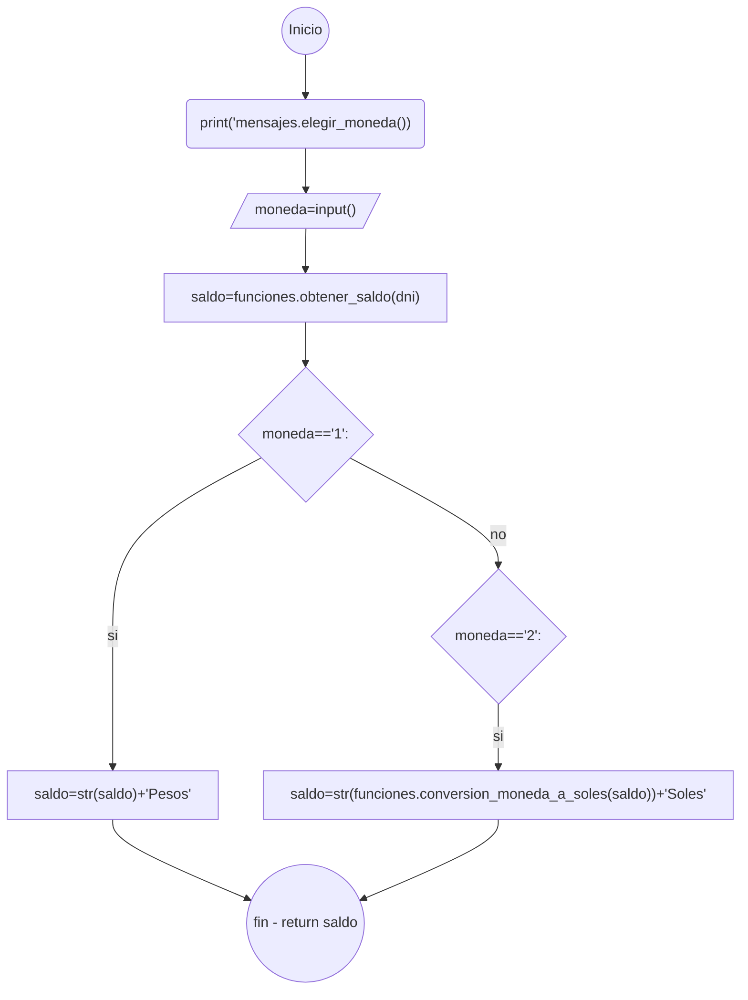

Grafo de complejidad ciclomatica función CONSULTAS:

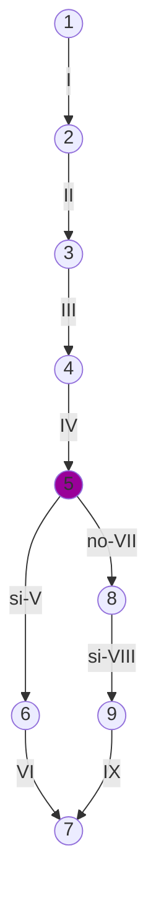
Calculos complejidad cilomatica función CONSULTAS:

-V(G)=Regiones=2.\
-V(G)=A-N+2=9-9+2=2.\
-V(G)=P+1=1+1=2

Caminos posibles función CONSULTAS:
-1-2-3-4-5-6-7\
-1-2-3-4-5-8-9-7

-----------------------------------------------------------------------------------------------------------------------------------------------------------------------

Diagrama de flujo de la función ULTIMOS_MOVIMIENTOS:

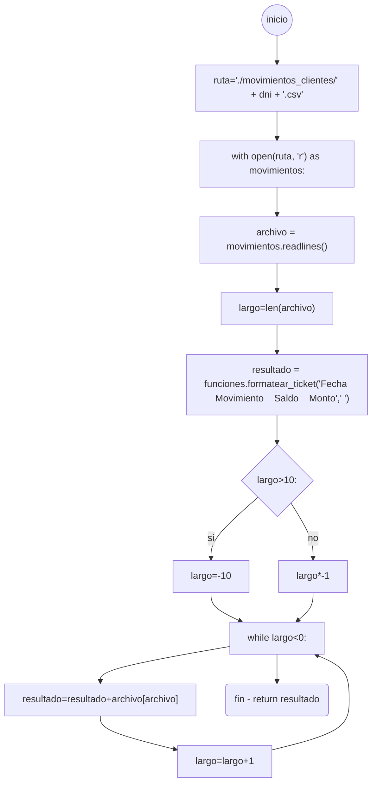

Grafo de complejidad ciclomatica función ULTIMOS_MOVIMIENTOS:

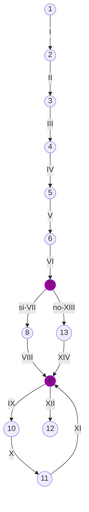

Calculos complejidad cilomatica función ULTIMOS_MOVIMIENTOS:

-V(G)=Regiones=3.\
-V(G)=A-N+2=14-12+2=4.\
-V(G)=P+1=2+1=3

Caminos posibles función ULTIMOS_MOVIMIENTOS:
-1-2-3-4-5-6-7-8-9-10-11-12\
-1-2-3-4-5-6-7-12-9-10-11-12\
-1-2-3-4-5-6-7-8-9-10-11-9-10-11-9-12

-----------------------------------------------------------------------------------------------------------------------------------------------------------------------

Diagrama de flujo función MENSAJE_ENTRADA del apartado funciones:

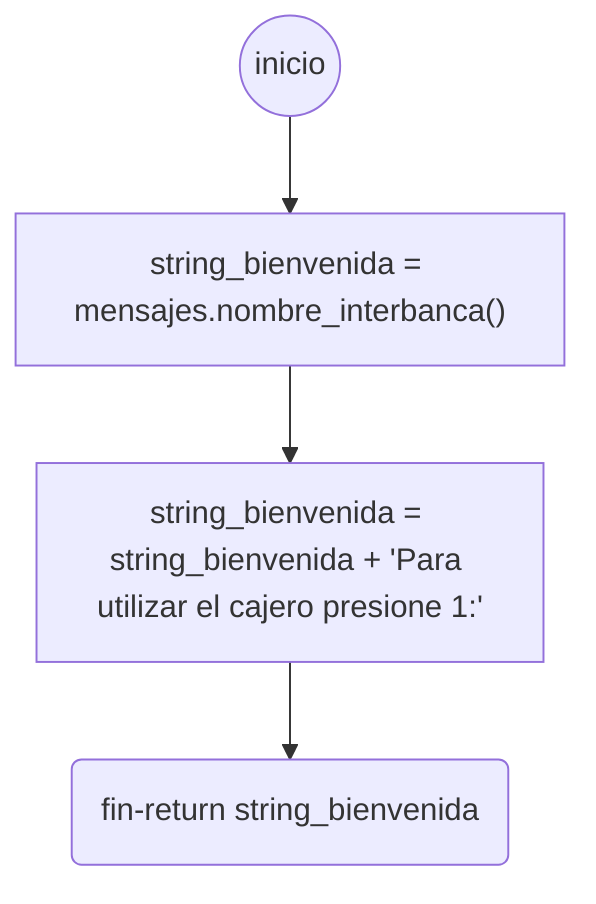

Grafo de complejidad ciclomatica función MENSAJE_ENTRADA del apartado funciones:

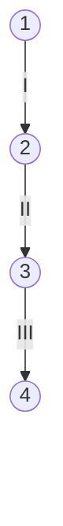
Calculos complejidad cilomatica función MENSAJE_ENTRADA del apartado funciones:

-V(G)=Regiones=1.\
-V(G)=A-N+2=3-4+2=1.\
-V(G)=P+1=0+1=1

Caminos posibles función MENSAJE_ENTRADA del apartado funciones:

-1-2-3-4

-----------------------------------------------------------------------------------------------------------------------------------------------------------------------

Diagrama de flujo de la función LIMITA_ENTRADA del apartado funciones:

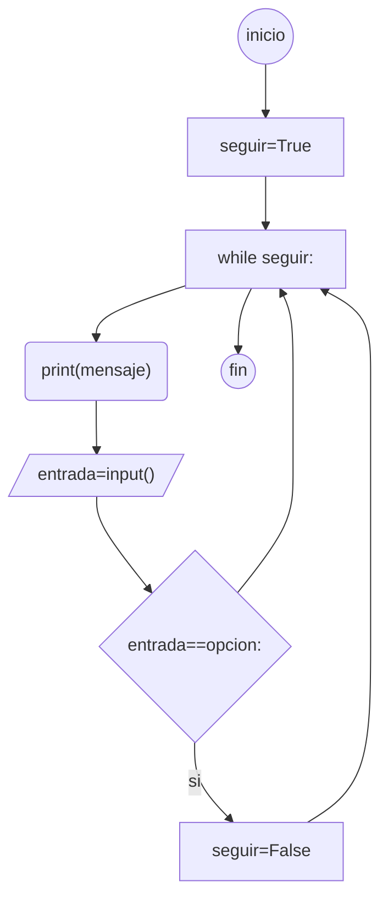

Grafo de complejidad de la función LIMITA_ENTRADA del apartado funciones:

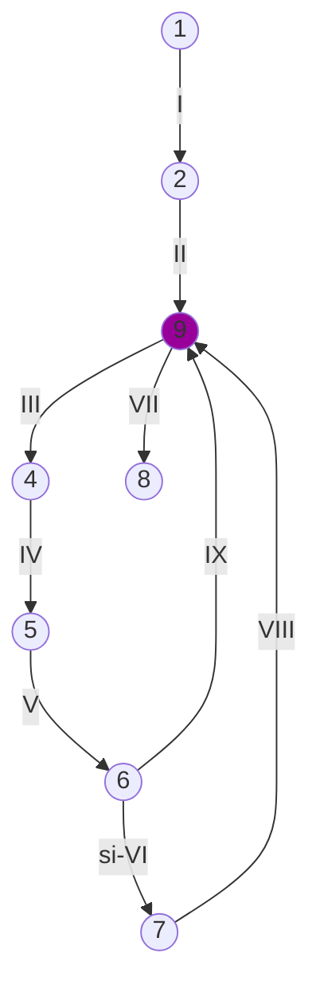

Calculos complejidad cilomatica función LIMITA_ENTRADA del apartado funciones:

-V(G)=Regiones=2.\
-V(G)=A-N+2=9-8+2=3.\
-V(G)=P+1=1+1=2.

Caminos posibles función LIMITA_ENTRADA del apartado funciones:

-1-2-3-4-5-6-7-3-8\
-1-2-3-4-5-6-3-4-5-6-7-3-8

-----------------------------------------------------------------------------------------------------------------------------------------------------------------------

Diagrama de flujo de la función CLEAR del apartado funciones:

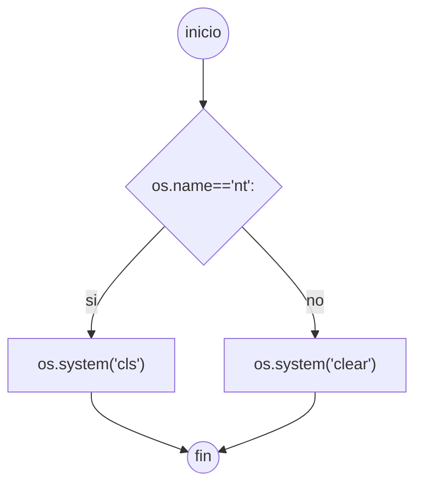

Grafo de complejidad de la función CLEAR del apartado funciones:

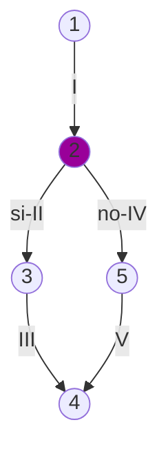

Calculos complejidad cilomatica función CLEAR del apartado funciones:

-V(G)=Regiones=2.\
-V(G)=A-N+2=5-5+2=2.\
-V(G)=P+1=1+1=2.

Caminos posibles función CLEAR del apartado funciones:

-1-2-3-4\
-1-2-5-4

-----------------------------------------------------------------------------------------------------------------------------------------------------------------------

Diagrama de flujo de la función OBTENER_CLAVE del apartado funciones:

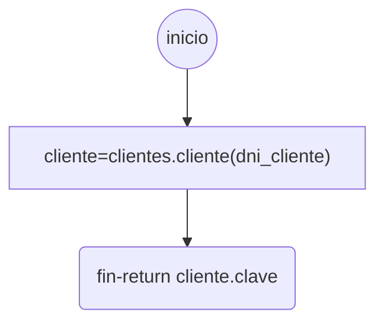

Grafo de complejidad de la función OBTENER_CLAVE del apartado funciones:

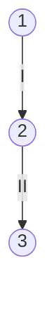
Calculos complejidad cilomatica función OBTENER_CLAVE del apartado funciones:

-V(G)=Regiones=1.\
-V(G)=A-N+2=2-3+2=1.\
-V(G)=P+1=0+1=1.

Caminos posibles función OBTENER_CALVE del apartado funciones:

-1-2-3.

-----------------------------------------------------------------------------------------------------------------------------------------------------------------------

Diagrama de flujo de la función FORMATEAR_TICKET del apartado funciones:

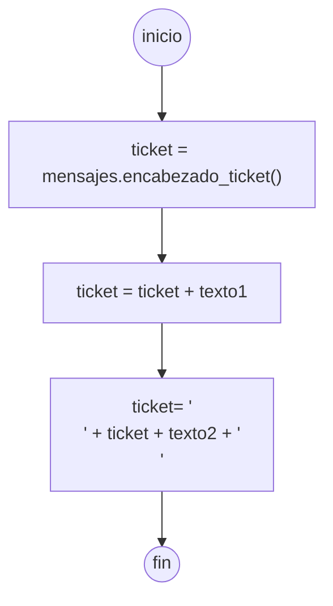

Grafo de complejidad ciclomatica de la función FORMATEAR_TICKET del apartado funciones:

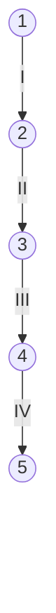

Calculos complejidad cilomatica función FORMATEAR_TICKET del apartado funciones:

-V(G)=Regiones=1.\
-V(G)=A-N+2=4-5+2=1.\
-V(G)=P+1=0+1=1.

Caminos posibles función FORMATEAR_TICKET del apartado funciones:

-1-2-3-4-5

-----------------------------------------------------------------------------------------------------------------------------------------------------------------------

Diagrama de flujo de la función GUARDAR_TICKET del apartado funciones:

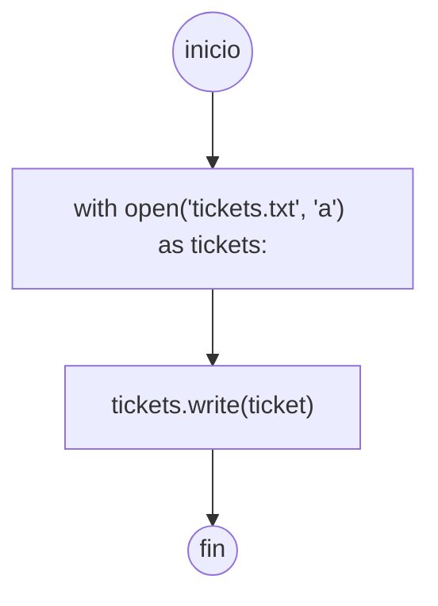

Grafo de complejidad ciclomatica de la función GUARDA_TICKET del apartado funciones:


Calculos complejidad cilomatica función GUARDAR_TICKET del apartado funciones:

-V(G)=Regiones=1.\
-V(G)=A-N+2=3-4+2=1.\
-V(G)=P+1=0+1=1.

Caminos posibles función GUARDAR_TICKET del apartado funciones:

-1-2-3-4.
   
-----------------------------------------------------------------------------------------------------------------------------------------------------------------------

Diagrama de flujo de la función SELECCIONAR_MONEDA del apartado funciones:

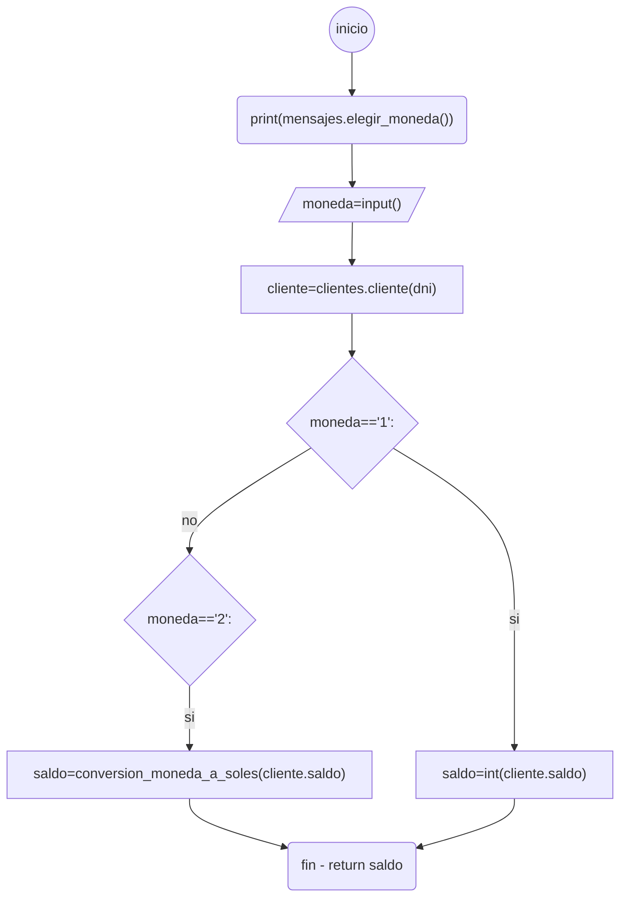

Grafo de complejidad ciclomatica de la función SELECCIONAR_MONEDA del apartado funciones:

```mermaid
graph
    a((1))-->|I|b((2))
    b-->|II|c((3))
    c-->|III|d((4))
    d-->|IV|e((5))
    e-->|si-V|f((6))
    e-->|no-VII|g((8))
    g-->|si-VIII|h((9))
    h-->|IX|i((7))
    f-->|VI|i

style e fill:#909

```

Calculos complejidad cilomatica función SELECCIONAR_MONEDA del apartado funciones:

-V(G)=Regiones=2.\
-V(G)=A-N+2=9-9+2=2.\
-V(G)=P+1=1+1=2.

Caminos posibles función SELECCIONAR_MONEDA del apartado funciones:

-1-2-3-4-5-6-7.\
-1-2-3-4-5-8-9-7.

-----------------------------------------------------------------------------------------------------------------------------------------------------------------------

Diagrama de flujo de la función CONVERSION_MONEDA_A_SOLES del apartado funciones:

```mermaid
graph
    a((inicio))--> b["conversion = 0.030834509* float(saldo)"]
    b-->c["conversion = round(conversion, 2)"]
    c-->d(fin - return conversion)
```

Grafo de complejidad ciclomatica de la función CONVERSION_MONEDA_A_SOLES del apartado funciones:

```mermaid
graph
    a((1))-->|I| b((2))
    b-->|II|c((3))
    c-->|III|d((4))
```
Calculos complejidad cilomatica función CONVERSION_MONEDA_A_SOLES del apartado funciones:

-V(G)=Regiones=1.\
-V(G)=A-N+2=3-4+2=1.\
-V(G)=P+1=0+1=1.

Caminos posibles función CONVERSION_MONEDA_A_SOLES del apartado funciones:

-1-2-3-4.

-----------------------------------------------------------------------------------------------------------------------------------------------------------------------

Diagrama de flujo de la función OBTENER_SALDO del apartado funciones:

```mermaid
