Diagrama de flujo función EXTRACCIONES. 

```mermaid
graph 
    a((inicio))-->b["funciones.modificar_saldo(dni, '2', monto)"]
    b-->c["saldo = funciones.obtener_saldo(dni)"]
    c-->d["ticket = funciones.formatear_ticket(f'Retiró {monto}\n', f'Su saldo es: {saldo}')"]
    d-->e(" print(ticket)")
    e-->f(fin-return ticket)

  ```

Grafo de complejidad función EXTRACCIONES.

```mermaid
graph 
    a((1))-->|I|b((2))
    b-->|II|c((3))
    c-->|III|d((4))
    d-->|IV|e((5))
    e-->|V|f((6))
```  

Calculos complejidad cilomatica función EXTRACCIONES:

-V(G)=Regiones=1.\
-V(G)=A-N+2=5-6+2=.1\
-V(G)=P+1=0+1=1.

Caminos posibles función EXTRACCIONES:

-1-2-3-4-5-6

-----------------------------------------------------------------------------------------------------------------------------------------------------------------------

Diagrama de flujo de la función CLIENTES:

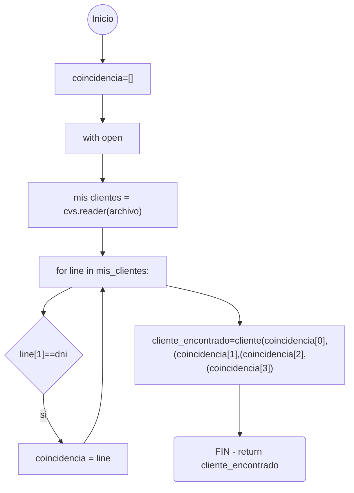

Grafo de complejidad ciclomatica función CLIENTES:

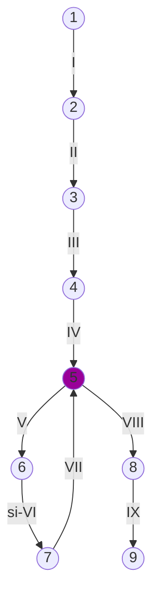
Calculos complejidad cilomatica función CLIENTES:

-V(G)=Regiones=2.\
-V(G)=A-N+2=9-9+2=2.\
-V(G)=P+1=1+1=2.

Caminos posibles función CLIENTES:

-1-2-3-4-5-6-7-8-9.\
-1-2-3-4-5-8-9

-----------------------------------------------------------------------------------------------------------------------------------------------------------------------

Diagrama de flujo función CONSULTAS:

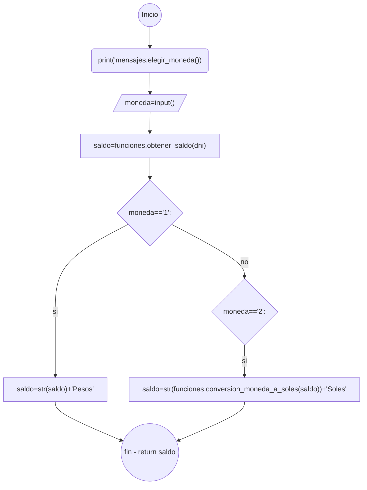

Grafo de complejidad ciclomatica función CONSULTAS:

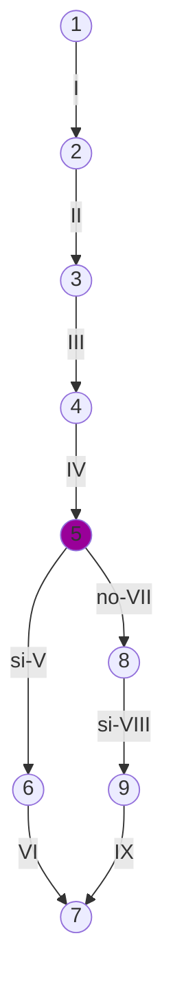
Calculos complejidad cilomatica función CONSULTAS:

-V(G)=Regiones=2.\
-V(G)=A-N+2=9-9+2=2.\
-V(G)=P+1=1+1=2

Caminos posibles función CONSULTAS:
-1-2-3-4-5-6-7\
-1-2-3-4-5-8-9-7

-----------------------------------------------------------------------------------------------------------------------------------------------------------------------

Diagrama de flujo de la función ULTIMOS_MOVIMIENTOS:

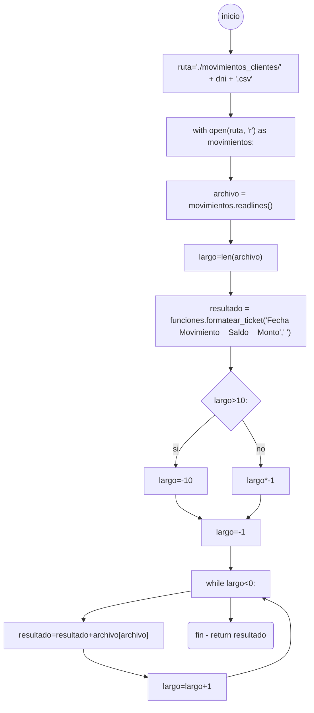

Grafo de complejidad ciclomatica función ULTIMOS_MOVIMIENTOS:

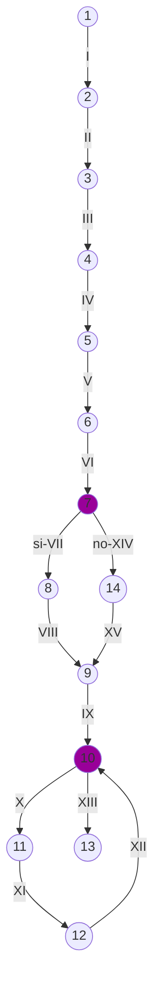

Calculos complejidad cilomatica función ULTIMOS_MOVIMIENTOS:

-V(G)=Regiones=3.\
-V(G)=A-N+2=15-14+2=3.\
-V(G)=P+1=2+1=3

Caminos posibles función ULTIMOS_MOVIMIENTOS:

-1-2-3-4-5-6-7-8-9-10-11-12-13.\
-1-2-3-4-5-6-7-14-9-10-11-12-13.\
-1-2-3-4-5-6-7-8-9-10-13.


-----------------------------------------------------------------------------------------------------------------------------------------------------------------------

Diagrama de flujo función MENSAJE_ENTRADA del apartado funciones:

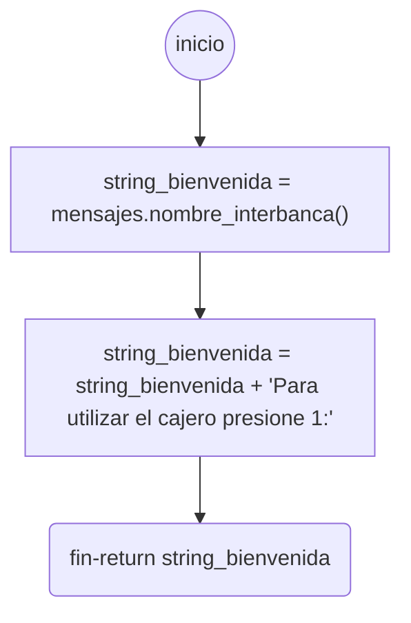

Grafo de complejidad ciclomatica función MENSAJE_ENTRADA del apartado funciones:

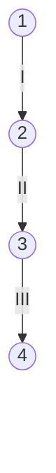
Calculos complejidad cilomatica función MENSAJE_ENTRADA del apartado funciones:

-V(G)=Regiones=1.\
-V(G)=A-N+2=3-4+2=1.\
-V(G)=P+1=0+1=1

Caminos posibles función MENSAJE_ENTRADA del apartado funciones:

-1-2-3-4

-----------------------------------------------------------------------------------------------------------------------------------------------------------------------

Diagrama de flujo de la función LIMITA_ENTRADA del apartado funciones:

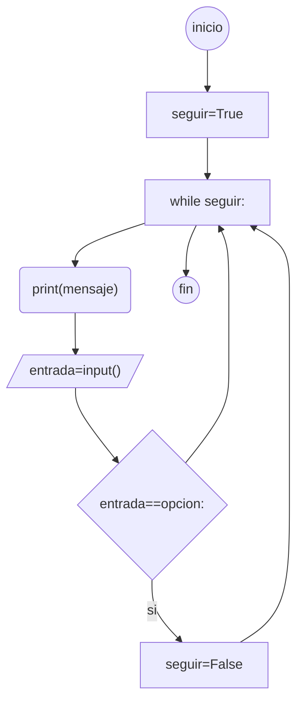

Grafo de complejidad de la función LIMITA_ENTRADA del apartado funciones:


Calculos complejidad cilomatica función LIMITA_ENTRADA del apartado funciones:

-V(G)=Regiones=2.\
-V(G)=A-N+2=9-8+2=3.\
-V(G)=P+1=1+1=2.

Caminos posibles función LIMITA_ENTRADA del apartado funciones:

-1-2-3-4-5-6-7-3-8\
-1-2-3-4-5-6-3-4-5-6-7-3-8

-----------------------------------------------------------------------------------------------------------------------------------------------------------------------

Diagrama de flujo de la función CLEAR del apartado funciones:

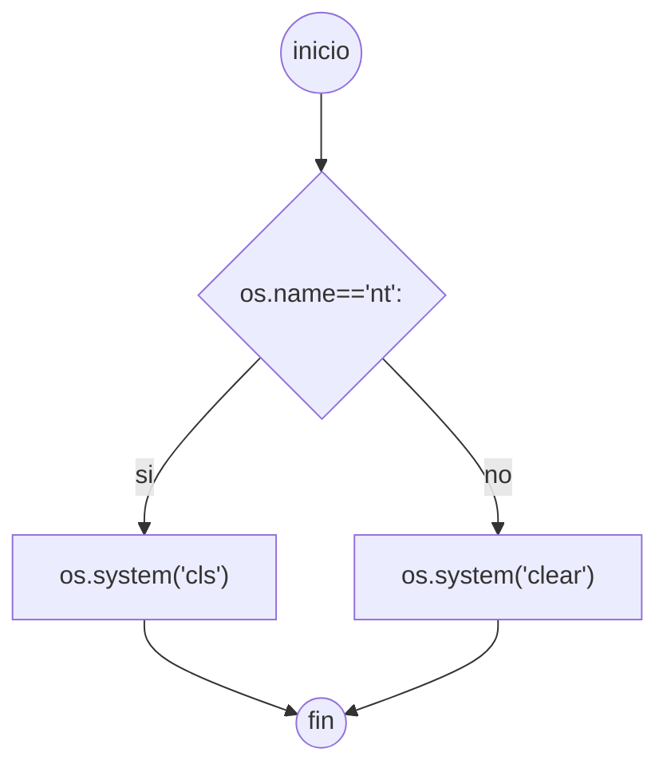

Grafo de complejidad de la función CLEAR del apartado funciones:

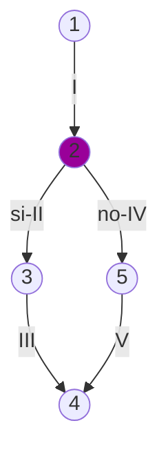

Calculos complejidad cilomatica función CLEAR del apartado funciones:

-V(G)=Regiones=2.\
-V(G)=A-N+2=5-5+2=2.\
-V(G)=P+1=1+1=2.

Caminos posibles función CLEAR del apartado funciones:

-1-2-3-4\
-1-2-5-4

-----------------------------------------------------------------------------------------------------------------------------------------------------------------------

Diagrama de flujo de la función OBTENER_CLAVE del apartado funciones:

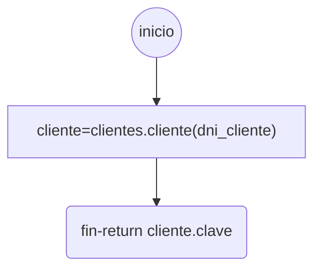

Grafo de complejidad de la función OBTENER_CLAVE del apartado funciones:

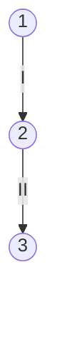
Calculos complejidad cilomatica función OBTENER_CLAVE del apartado funciones:

-V(G)=Regiones=1.\
-V(G)=A-N+2=2-3+2=1.\
-V(G)=P+1=0+1=1.

Caminos posibles función OBTENER_CALVE del apartado funciones:

-1-2-3.

-----------------------------------------------------------------------------------------------------------------------------------------------------------------------

Diagrama de flujo de la función FORMATEAR_TICKET del apartado funciones:

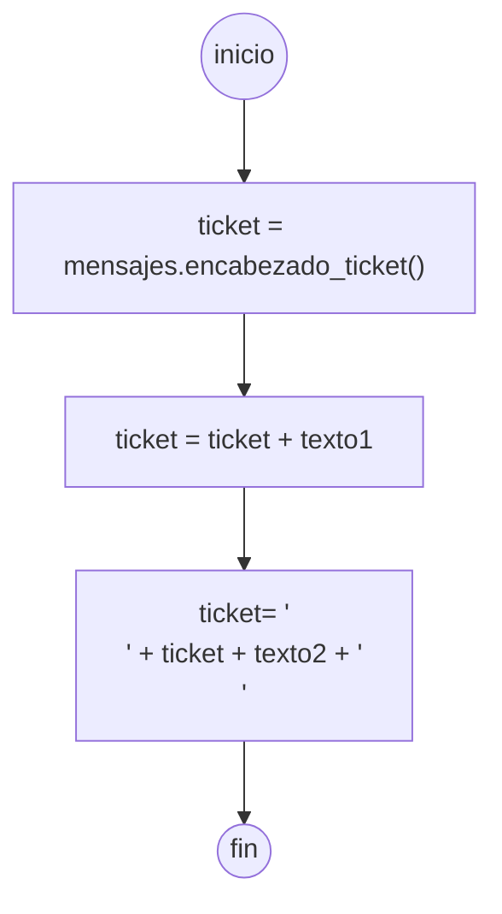

Grafo de complejidad ciclomatica de la función FORMATEAR_TICKET del apartado funciones:

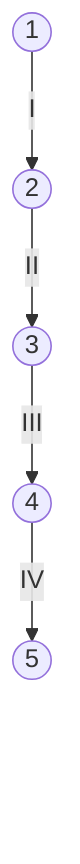

Calculos complejidad cilomatica función FORMATEAR_TICKET del apartado funciones:

-V(G)=Regiones=1.\
-V(G)=A-N+2=4-5+2=1.\
-V(G)=P+1=0+1=1.

Caminos posibles función FORMATEAR_TICKET del apartado funciones:

-1-2-3-4-5

-----------------------------------------------------------------------------------------------------------------------------------------------------------------------

Diagrama de flujo de la función GUARDAR_TICKET del apartado funciones:

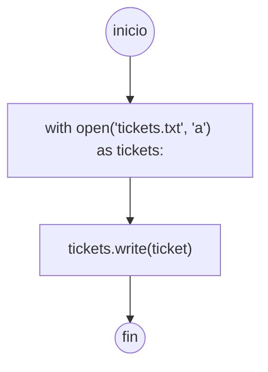

Grafo de complejidad ciclomatica de la función GUARDA_TICKET del apartado funciones:


Calculos complejidad cilomatica función GUARDAR_TICKET del apartado funciones:

-V(G)=Regiones=1.\
-V(G)=A-N+2=3-4+2=1.\
-V(G)=P+1=0+1=1.

Caminos posibles función GUARDAR_TICKET del apartado funciones:

-1-2-3-4.
   
-----------------------------------------------------------------------------------------------------------------------------------------------------------------------

Diagrama de flujo de la función SELECCIONAR_MONEDA del apartado funciones:

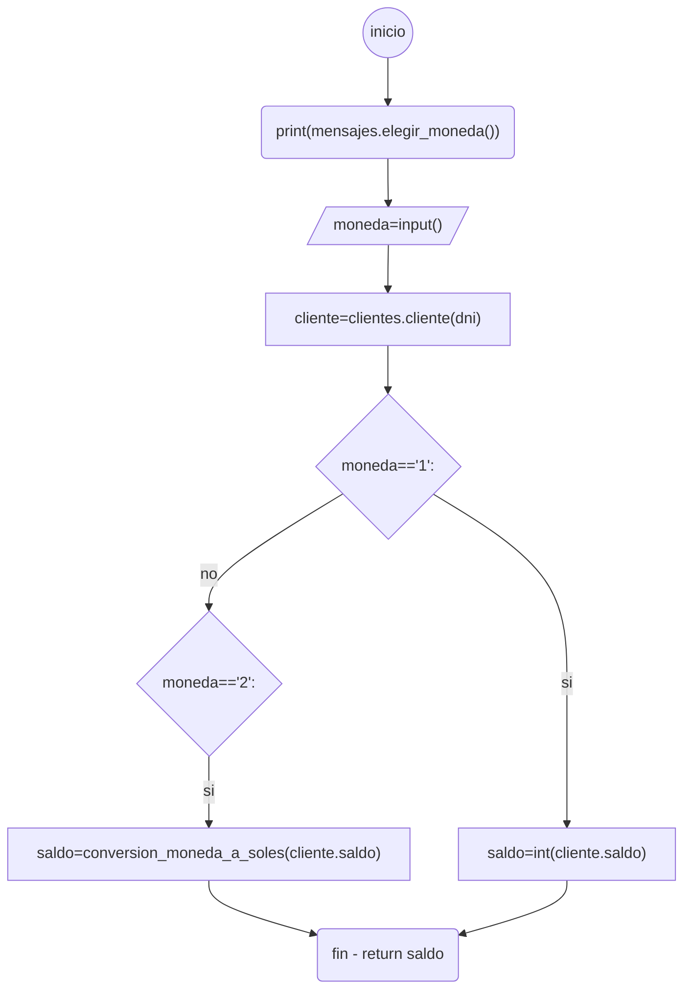

Grafo de complejidad ciclomatica de la función SELECCIONAR_MONEDA del apartado funciones:

```mermaid
graph
    a((1))-->|I|b((2))
    b-->|II|c((3))
    c-->|III|d((4))
    d-->|IV|e((5))
    e-->|si-V|f((6))
    e-->|no-VII|g((8))
    g-->|si-VIII|h((9))
    h-->|IX|i((7))
    f-->|VI|i

style e fill:#909
```

Calculos complejidad cilomatica función SELECCIONAR_MONEDA del apartado funciones:

-V(G)=Regiones=2.\
-V(G)=A-N+2=9-9+2=2.\
-V(G)=P+1=1+1=2.

Caminos posibles función SELECCIONAR_MONEDA del apartado funciones:

-1-2-3-4-5-6-7.\
-1-2-3-4-5-8-9-7.

-----------------------------------------------------------------------------------------------------------------------------------------------------------------------

Diagrama de flujo de la función CONVERSION_MONEDA_A_SOLES del apartado funciones:

```mermaid
graph
    a((inicio))--> b["conversion = 0.030834509* float(saldo)"]
    b-->c["conversion = round(conversion, 2)"]
    c-->d(fin - return conversion)
```

Grafo de complejidad ciclomatica de la función CONVERSION_MONEDA_A_SOLES del apartado funciones:

```mermaid
graph
    a((1))-->|I| b((2))
    b-->|II|c((3))
    c-->|III|d((4))
```

Calculos complejidad cilomatica función CONVERSION_MONEDA_A_SOLES del apartado funciones:

-V(G)=Regiones=1.\
-V(G)=A-N+2=3-4+2=1.\
-V(G)=P+1=0+1=1.

Caminos posibles función CONVERSION_MONEDA_A_SOLES del apartado funciones:

-1-2-3-4.

-----------------------------------------------------------------------------------------------------------------------------------------------------------------------

Diagrama de flujo de la función OBTENER_SALDO del apartado funciones:

```mermaid
graph
    a((inicio))-->b["ruta = './movimientos_clientes/' + dni + '.csv'"]
    b-->c["with open(ruta, 'r') as f:"]
    c-->d["lineas = csv.reader(f)"]
    d-->e[for linea in lineas:]
    e-->f[pass]
    f-->e
    e-->g["saldo=linea[-2]"]
    g-->h(fin-return saldo)
```

Grafo de complejidad ciclomatica de la función OBTENER_SALDO del apartado funciones:

```mermaid
graph
    a((1))-->|I|b((2))
    b-->|II|c((3))
    c-->|III|d((4))
    d-->|IV|e((5))
    e-->|V|f((6))
    f-->|VI|e
    e-->|VII|g((7))
    g-->|VIII|h((8))

style e fill:#909
```

Calculos complejidad cilomatica función OBTENER_SALDO del apartado funciones:

-V(G)=Regiones=2.\
-V(G)=A-N+2=8-8+2=2.\
-V(G)=P+1=1+1=2.

Caminos posibles función OBTENER_SALDO del apartado funciones:

-1-2-3-4-5-6-7-8\
-1-2-3-4-5-6-5-6-7-8

-----------------------------------------------------------------------------------------------------------------------------------------------------------------------

Diagrama de flujo de la función MODIFICAR_SALDO del apartado funciones:

```mermaid
graph
    a((inicio))-->b["ruta = './movimientos_clientes/' + dni + '.csv'"]
    b-->c["fecha_hora = datetime.datetime.now()"]
    c-->d["fecha_hora = fecha_hora.strftime('%m/%d/%Y %H:%M')"]
    d-->e["saldo = int(obtener_saldo(dni))"]
    e-->f["monto = int(monto)"]
    f-->g{"movimiento=='1'"}
    g-->|si|h["movimiento = "deposito""]
    h-->i["saldo = saldo + monto"]
    i-->z["linea = [fecha_hora, movimiento, saldo, monto]"]
    g-->|sino|j{"movimiento =='2'"}
    j-->|si|k{monto>saldo:}
    k-->|si|l[raise saldo_insuficiente_exception]
    k-->|no|m["movimiento='extraccion'"]
    m-->n["saldo=saldo-monto"]
    l-->z
    n-->z
    j-->|sino|p{movimiento=='3'}
    p-->|si|q{"monto>saldo:"}
    q-->|si|r[raise saldo_insuficiente_exception]
    q-->|no|s["movimiento = 'transferencia'"]
    s-->t["saldo = saldo - monto"]
    r-->z
    t-->z
    z-->u["with open(ruta, 'a') as archivo:"]
    u-->v["escritor = csv.writer(archivo)"]
    v-->w["escritor.writerow(linea)"]
    w-->x((fin))
```

Grafo de complejidad ciclomatica de la función MODIFICAR_SALDO del apartado funciones:

```mermaid
graph
    a((1))-->|I|b((2))
    b-->|II|c((3))
    c-->|III|d((4))
    d-->|IV|e((5))
    e-->|V|f((6))
    f-->|VI|g((7))
    g-->|si-VII|h((8))
    h-->|VIII|i((9))
    i-->|IX|z((10))
    g-->|sino-XIV|j((15))
    j-->|si-XV|k((16))
    k-->|si-XVI|l((17))
    k-->|no-XVIII|m((18))
    m-->|XIX|n((19))
    l-->|VII|z
    n-->|XX|z
    j-->|sino-XXI|p((20))
    p-->|si-XXII|q((21))
    q-->|si-XXIII|r((22))
    q-->|no-XXV|s((23))
    s-->|XXVI|t((24))
    r-->|XXIV|z
    t-->|XXVII|z
    z-->|X|u((11))
    u-->|XI|v((12))
    v-->|XII|w((13))
    w-->|XIII|x((14))
    
style g fill:#909    
style j fill:#909 
style k fill:#909 
style p fill:#909 
style q fill:#909 
```
Calculos complejidad cilomatica función MODIFICAR_SALDO del apartado funciones:

-V(G)=Regiones=5.\
-V(G)=A-N+2=27-24+2=5.\
-V(G)=P+1=4+1=5.

Caminos posibles función MODIFICAR_SALDO del apartado funciones:

-1-2-3-4-5-6-7-8-9-10-11-12-13-14.\
-1-2-3-4-5-6-7-15-16-17-10-11-12-13-14.\
-1-2-3-4-5-6-7-15-16-18-19-10-11-12-13-14.\
-1-2-3-4-5-6-7-15-20-21-22-10-11-12-13-14.\
-1-2-3-4-5-6-7-15-20-21-23-24-10-11-12-13-14.

-----------------------------------------------------------------------------------------------------------------------------------------------------------------------

Diagrama de flujo de la función QUIERE_IMPRIMIR_TICKET del apartado mensajes:

```mermaid
graph
    a((inicio))-->b["opcion =' '"]
    b-->c["while opcion != 's' and opcion != 'n': "]
    c-->d["opcion = input('Quiere imprimir el ticket: s/n -> ')"]
    d-->e["opcion = opcion.lower()"]
    e-->c
    c-->f["resultado = False"]
    f-->g{"opcion=='s'"}
    g-->|si|h[resultado=True]
    h-->i(fin-return resultado)
    g-->i
```
Grafo de complejidad ciclomatica de la función QUIERE_IMPRIMIR_TICKET del apartado mensajes:

```mermaid
graph
    a((1))-->|I|b((2))
    b-->|II|c((3))
    c-->|III|d((4))
    d-->|IV|e((5))
    e-->|V|c
    c-->|VI|f((6))
    f-->|VII|g((7))
    g-->|si-VIII|h((8))
    h-->|IX|i((9))
    g-->|X|i

style c fill:#909 
style g fill:#909 
```
Calculos complejidad cilomatica función QUIERE_IMPRIMIR_TICKET del apartado funciones:

-V(G)=Regiones=3.\
-V(G)=A-N+2=10-9+2=3.\
-V(G)=P+1=2+1=3.

Caminos posibles función QUIERE_IMPRIMIR_TICKET del apartado funciones:

-1-2-3-4-5-3-6-7-8-9.\
-1-2-3-4-5-3-6-7-9.\
-1-2-3-6-7-9.

-----------------------------------------------------------------------------------------------------------------------------------------------------------------------

Diagrama de flujo de la función QUIERE_CONTINUAR del apartado mensajes:

```mermaid


